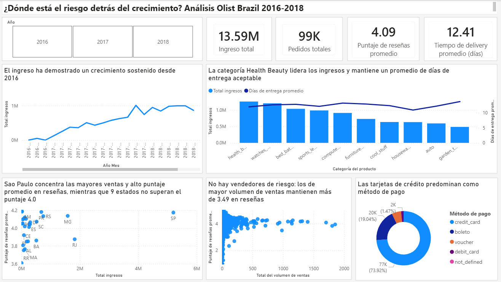

# ¿Dónde está el riesgo detrás del crecimiento? Análisis Olist Brazil 2016-2018

## Fuente de datos

**Brazilian E-Commerce Public Dataset by Olist**

Autor: Olist (olistbr), disponible en [Kaggle](https://www.kaggle.com/datasets/olistbr/brazilian-ecommerce)

Este dataset está licenciado bajo [CC BY-NC-SA 4.0](https://creativecommons.org/licenses/by-nc-sa/4.0/).

Proyecto es de carácter educativo/portafolio y no comercial, en línea con los términos de la licencia.

## Preguntas de negocio que responde el dashboard:
1. ¿Cómo evoluciona el ingreso mensual y qué método de pago se usa con más frecuencia?

3. ¿Qué categorías de producto generan más ingresos por venta de productos pero tienen mayor tiempo promedio de entrega?

4. ¿Qué estados concentran más ingresos por ventas y cuáles tienen peor promedio simple de review_score?

6. ¿Qué vendedores tienen mayor cantidad de artículos vendidos pero peor promedio de review_score? 

   
## Hallazgos
1. El ingreso ha demostrado un crecimiento sostenido desde 2016
2. Las tarjetas de crédito predominan como método de pago más frecuentado
3. La categoría Health Beauty lidera los ingresos y mantiene un promedio de días de entrega aceptable
4. Sao Paulo concentra las mayores ventas y alto puntaje promedio en reseñas, mientras que 9 estados no superan el puntaje 4.0
5. No hay vendedores de riesgo: los de mayor volumen de ventas mantienen más de 3.49 en reseñas

## Consideraciones durante la limpieza de datos
1. Se identificaron datos incompletos en los meses de septiembre y octubre del 2018 por lo que se decidió no trabajar con sus datos.
2. Se integraron los nombres traducidos de la tabla product_category_name_translation directamente a la tabla olist_products_dataset para reducir la carga de tablas en el dashboard
3. Se creo una categoría "Sin categoria" para aquellos productos con categoría nula
4. No se utilizó la tabla olist_geolocation_dataset al no utilizar visualizaciones de mapa

## Definiciones

## Herramientas utilizadas
Power BI Desktop, DAX, Power Query y Excel
